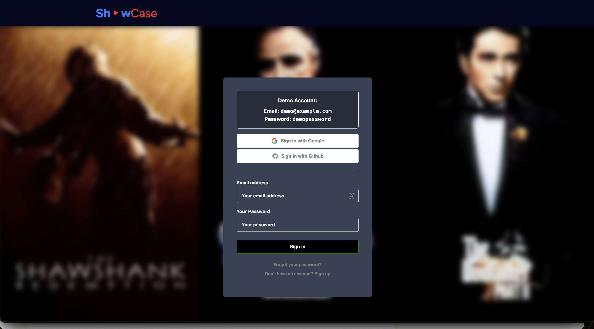
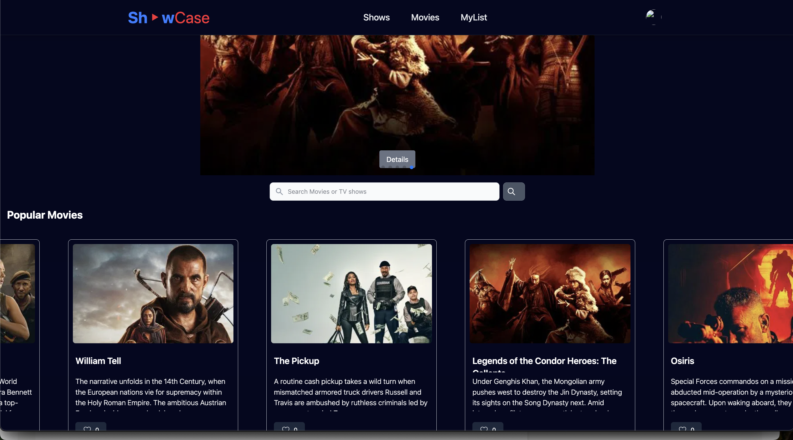
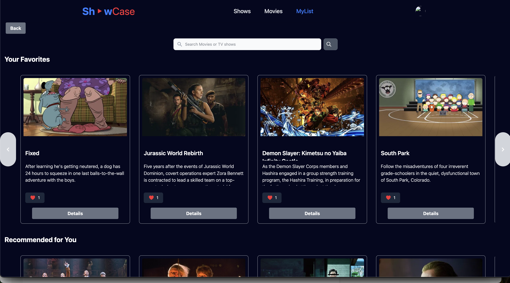

A lightweight React app to **explore movies and TV shows**, **save favorites**, and try out **Supabase authentication** — built as a fun project to learn modern web tools.

---

## ✨ Features

- 🔍 **Movie & TV Search** – Quickly find movies or TV shows by title using the TMDB API.
- ⭐ **Top Picks** – Automatically shows highly-rated titles with beautiful posters.
- ❤️ **Favorites** – Sign in and save movies or shows you like; your list stays synced to your account.
- 🔐 **Authentication** – Login via **Google** or **GitHub** using Supabase.
- 👀 **Demo Account** – Try it out without signing up.
- 📱 **Responsive Design** – Works well on desktop and mobile.

---

## 🛠 Tech Stack

- **React (Vite)** – Fast frontend development
- **TailwindCSS** – Utility-first CSS for quick styling
- **Supabase** – Authentication and favorites storage
- **TMDB API** – Source for all the movie & TV data
- **Vercel** – Deployment & hosting

---

## 🖼 Screenshots / Preview

**Sign In Page:**

**Home Page:**

**Favorites List:**

---

## 🚀 How to Login & Use

1. **Visit the app**: [Live on Vercel](https://movie-search-app-vidyashree-tarikeres-projects.vercel.app)
2. **Choose how to sign in**:
   - Google or GitHub via Supabase
   - Or use the **demo credentials** shown on the login page
3. **Search for movies or TV shows** using the search bar at the top.
4. **Add to Favorites** ❤️ to save any title to your profile (requires login).
5. **Open your favorites list** to view saved titles.
6. **Explore details** instantly with posters, ratings, and more.

---
